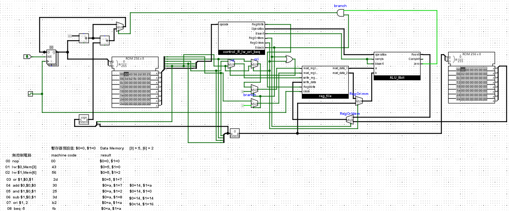

# Single-Cycle-8-bit-CPU
This repository contains the design and implementation of a single-cycle 8-bit processor with only two registers, developed as part of the course project.

## Instruction Set Architecture (ISA)

The processor follows a simple instruction encoding scheme where the operation can be identified by examining the top bits of each byte.

### Key Features
- **Separate instruction and data memory**
- **Two general-purpose registers (`$ra`, `$rb`)**
- Supports arithmetic, logical, and branching instructions.

### Instruction Encoding Table
| Bit  | 7 | 6 | 5 | 4 | 3 | 2 | 1 | 0 | Description                          |
|------|---|---|---|---|---|---|---|---|--------------------------------------|
| nop  | 0 | 0 | 0 | 0 | 0 | 0 | 0 | 0 | No operation                         |
| and  | 0 | 0 | 1 | 0 | 0 | rd| ra| rb| `$rd = $ra & $rb`                    |
| or   | 0 | 0 | 1 | 0 | 1 | rd| ra| rb| `$rd = $ra | $rb`                    |
| add  | 0 | 0 | 1 | 1 | 0 | rd| ra| rb| `$rd = $ra + $rb`                    |
| sub  | 0 | 0 | 1 | 1 | 1 | rd| ra| rb| `$rd = $ra - $rb`                    |
| lw   | 0 | 1 | 0 | rd| immediate|||     | `$rd = MEM[imm]`                     |
| ori  | 1 | 0 | 1 | rd| immediate|||     | `$rd = $rd | imm`                    |
| beq  | 1 | 1 | 1 | offset          ||||  | Branch if `$ra == $rb`               |

```
<table border="1" cellspacing="0" cellpadding="5">
  <tr>
    <th>Bit</th>
    <th>7</th>
    <th>6</th>
    <th>5</th>
    <th>4</th>
    <th>3</th>
    <th>2</th>
    <th>1</th>
    <th>0</th>
    <th>Description</th>
  </tr>
  <tr>
    <td><b>nop</b></td>
    <td>0</td><td>0</td><td>0</td><td>0</td><td>0</td><td>0</td><td>0</td><td>0</td>
    <td>No operation</td>
  </tr>
  <tr>
    <td><b>and</b></td>
    <td>0</td><td>0</td><td>1</td><td>0</td><td><b>rd</b></td><td><b>ra</b></td><td><b>rb</b></td><td></td>
    <td>$rd = $ra &amp; $rb</td>
  </tr>
  <tr>
    <td><b>or</b></td>
    <td>0</td><td>0</td><td>1</td><td>0</td><td>1</td><td><b>rd</b></td><td><b>ra</b></td><td><b>rb</b></td>
    <td>$rd = $ra | $rb</td>
  </tr>
  <tr>
    <td><b>add</b></td>
    <td>0</td><td>0</td><td>1</td><td>1</td><td>0</td><td><b>rd</b></td><td><b>ra</b></td><td><b>rb</b></td>
    <td>$rd = $ra + $rb</td>
  </tr>
  <tr>
    <td><b>sub</b></td>
    <td>0</td><td>0</td><td>1</td><td>1</td><td>1</td><td><b>rd</b></td><td><b>ra</b></td><td><b>rb</b></td>
    <td>$rd = $ra - $rb</td>
  </tr>
  <tr>
    <td><b>lw</b></td>
    <td>0</td><td>1</td><td>0</td><td><b>rd</b></td><td colspan="4"><b>immediate</b></td>
    <td>$rd = MEM[imm]</td>
  </tr>
  <tr>
    <td><b>sw</b></td>
    <td>0</td><td>1</td><td>1</td><td><b>rd</b></td><td colspan="4"><b>immediate</b></td>
    <td>MEM[imm] = $rd</td>
  </tr>
  <tr>
    <td><b>ori</b></td>
    <td>1</td><td>0</td><td>1</td><td><b>rd</b></td><td colspan="4"><b>immediate</b></td>
    <td>$rd = $rd | imm</td>
  </tr>
  <tr>
    <td><b>beq</b></td>
    <td>1</td><td>1</td><td>1</td><td colspan="5"><b>offset</b></td>
    <td>Branch if $ra == $rb</td>
  </tr>
</table>
```

---

#### Notes
- **nop:** No operation is performed.  
- **Arithmetic operations:** Support basic logical and arithmetic functions (`and`, `or`, `add`, `sub`).  
- **lw:** Loads data from memory into the register `$rd`.(**immediate uses un-signed extension**)     
- **ori:** Bitwise OR between the register and immediate value.(**immediate uses un-signed extension**)   
- **beq:** Branches to an offset if the two registers are equal.(**offset uses signed extension**)  

### Branching Behavior
The `beq` instruction operates similarly to MIPS:
```asm
if $ra == $rb:
  PC = PC + 1 + offset
else:
  PC = PC + 1
```
---

### CPU Circuit Diagram


---

### How to Build and Simulate
- **Use Logisim to simulate this project:**  
  1. Clone the repository:
     ```bash
     git clone https://github.com/jack74387/Single-Cycle-8-bit-CPU.git
     ```
  2. Open the circuit in **Logisim**:  
     - download and install [Logisim](https://github.com/logisim-evolution/logisim-evolution?tab=readme-ov-file) 
     - Open `single-cycle-cpu.circ` from the project directory.  
  3. Run the simulation:  
     - Click the **Clock** icon to step through instructions manually.  
     - Observe the changes in registers and memory for each cycle.
